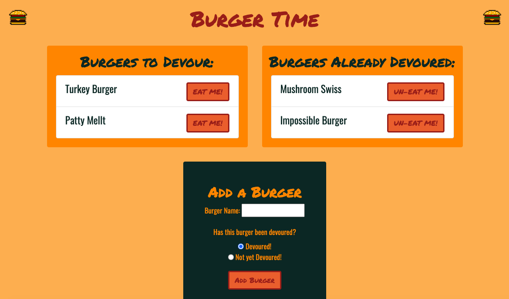

# Burger Time!

Deployed app: [Click Here!](https://blooming-refuge-88566.herokuapp.com/)

This app uses MySQL, node.js, Express, and Handlebars to show a database filled with burgers. The user can create new burgers, "eat" burgers, and "un-eat" burgers. The content on the page will dynamically change depending on the user's interactions.



## Instructions for Use
* Navigate to deployed application at: ```https://blooming-refuge-88566.herokuapp.com/```
* From here, you can "devour" or "un-eat" burgers by clicking on the respective buttons
* You can also add a burger by filling out the form and pressing "Add Burger" at the bottom of the page

## Technologies Used
* JavaScript
* jQuery
* MySQL
* node.js
* Express
* Handlebars
* HTML5
* CSS/Bootstrap

## License
Copyright 2020 Lili Clift Licensed under MIT license.